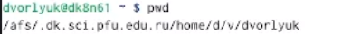
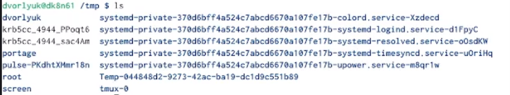
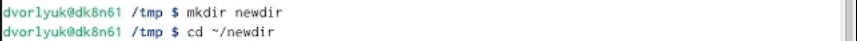
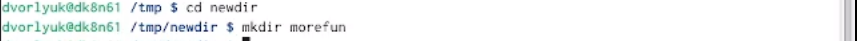
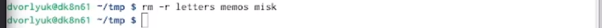
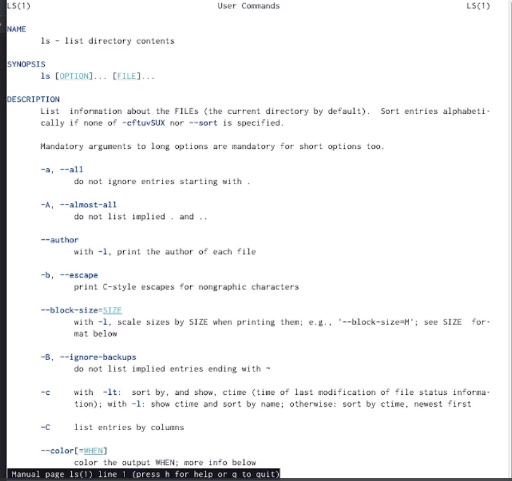

---
## Front matter
title: "Лабортароная работа №4"
subtitle: "Основы интерфейса взаимодействия пользователя с системой Unix на уровне командной строки"
author: "Дмитрий Владимирович Орлюк"

## Generic otions
lang: ru-RU
toc-title: "Содержание"

## Bibliography
bibliography: bib/cite.bib
csl: pandoc/csl/gost-r-7-0-5-2008-numeric.csl

## Pdf output format
toc: true # Table of contents
toc-depth: 2
lof: true # List of figures
lot: true # List of tables
fontsize: 12pt
linestretch: 1.5
papersize: a4
documentclass: scrreprt
## I18n polyglossia
polyglossia-lang:
  name: russian
  options:
	- spelling=modern
	- babelshorthands=true
polyglossia-otherlangs:
  name: english
## I18n babel
babel-lang: russian
babel-otherlangs: english
## Fonts
mainfont: PT Serif
romanfont: PT Serif
sansfont: PT Sans
monofont: PT Mono
mainfontoptions: Ligatures=TeX
romanfontoptions: Ligatures=TeX
sansfontoptions: Ligatures=TeX,Scale=MatchLowercase
monofontoptions: Scale=MatchLowercase,Scale=0.9
## Biblatex
biblatex: true
biblio-style: "gost-numeric"
biblatexoptions:
  - parentracker=true
  - backend=biber
  - hyperref=auto
  - language=auto
  - autolang=other*
  - citestyle=gost-numeric
## Pandoc-crossref LaTeX customization
figureTitle: "Рис."
tableTitle: "Таблица"
listingTitle: "Листинг"
lofTitle: "Список иллюстраций"
lotTitle: "Список таблиц"
lolTitle: "Листинги"
## Misc options
indent: true
header-includes:
  - \usepackage{indentfirst}
  - \usepackage{float} # keep figures where there are in the text
  - \floatplacement{figure}{H} # keep figures where there are in the text
---

# Цель работы

Приобретение практических навыков взаимодействия пользователя с системой по-
средством командной строки.

# Выполнение лабораторной работы

1. Перейдем в домашний каталог командой cd  (рис. @fig:001).

{#fig:001 width=90%}

2. С помощью команды ls выводим на экран содержимое каталога (рис. @fig:002).

{#fig:002 width=90%}

3. С помощью команды mkdir создадим новый каталог (рис. @fig:003).

{#fig:003 width=90%}

4. Перейдем в этот каталог и создадим новый в нем (рис. @fig:004).

{#fig:004 width=90%}

5. Одной командой mkdir создаем сразу три каталога

{#fig:005 width=90%}

6. Удалим командой rm эти же три каталога

{#fig:006 width=90%}

7. С помощью команды man узнаем больше подробностей про команду cd (а также pwd mkdir rmdir rm)

{#fig:007 width=90%}

8. Увидим что выводит команда man

{#fig:008 width=90%}

# Выводы

В ходе выполнения лабораторной работы №4 я приобрел практические навыкы взаимодействия с системой по-
средством командной строки. Узнал о команда man

# Список литературы{.unnumbered}

::: {#refs}
:::
